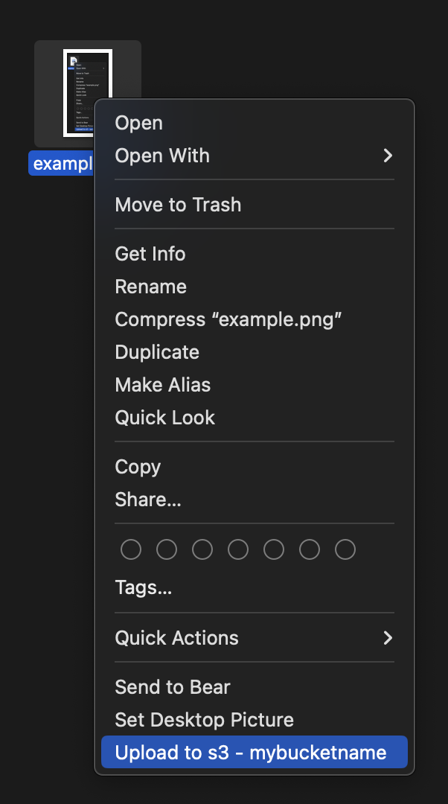

# straight-up

This tool installs a
[macOS Automator Workflow](https://support.apple.com/en-ca/guide/automator/welcome/2.10/mac)
in `~/Library/Services` which can be invoked with a right-click to upload a file
to [S3](https://aws.amazon.com/s3/).

## usage

1. install the workflow by running;

   ```bash
   npx straight-up setup s3://mybucketname
   ```

2. Right-Click on a file in Finder and select `Services` ->
   `Upload to S3 - mybucketname` to upload your file


